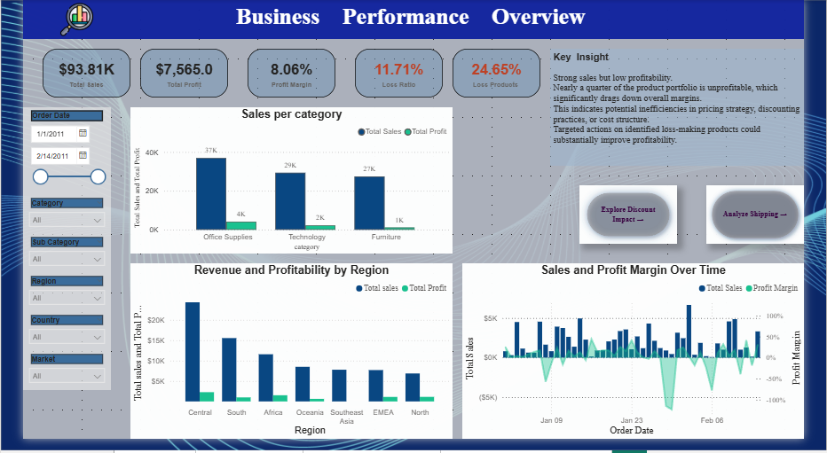
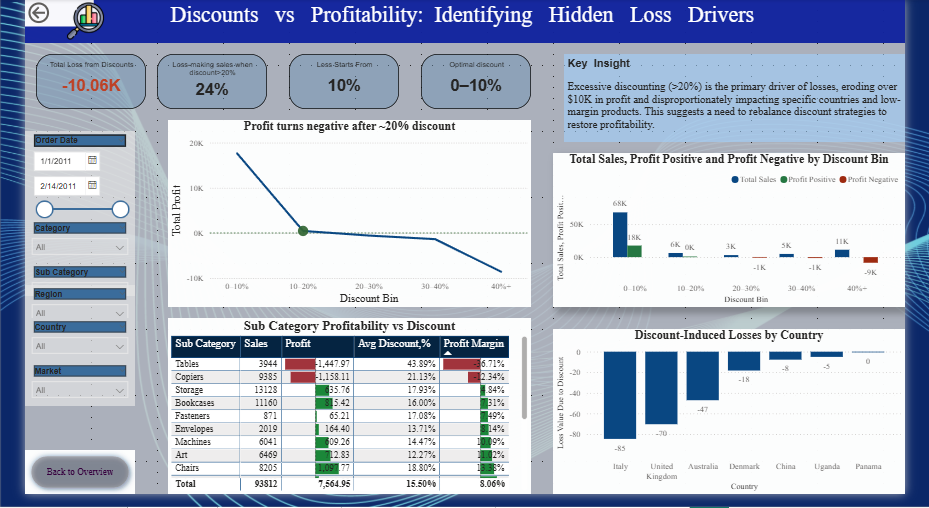
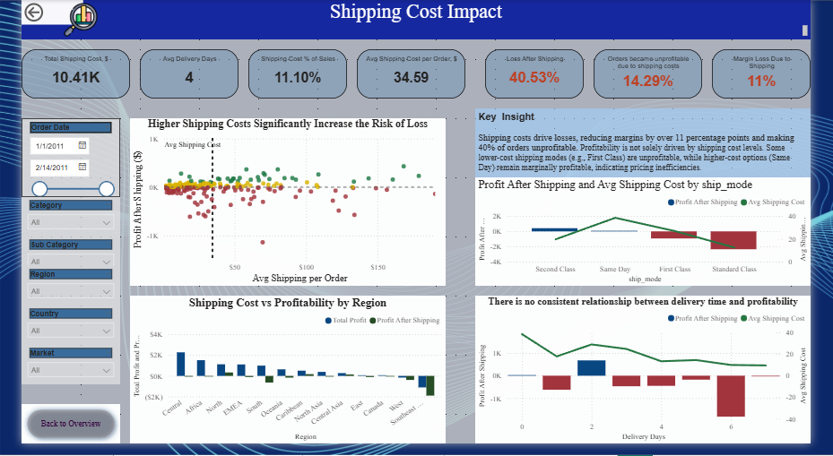

📊 E-commerce Profitability Analysis

📌 Overview

This project analyzes an e-commerce dataset to understand why strong sales performance does not translate into profitability.
The analysis focuses on how discount strategies, shipping costs, and pricing decisions drive losses and reduce margins.

🎯 Business Problem

Despite high sales volume, the business operates at low profitability, with a large share of transactions becoming unprofitable.

The objective was to:

Identify root causes of losses
Quantify the impact of discounts and shipping
Develop actionable pricing recommendations

🧹 Data Preparation

Data preparation was performed in MySQL, where raw transactional data was cleaned, structured, and enhanced with calculated fields (e.g., delivery time).
The processed dataset was then used in Power BI to build analytical models, KPIs, and interactive dashboards.

SalesOrdersProject/
│
├── README.md
│
├── data/
│   ├── raw/
│   │   └── SalesOrdersOriginalSet.csv
│   └── processed/
│       └── Optimization.csv
│
├── sql/
│   └── schema.sql
│
├── powerbi/
│   └── dashboard.pbix
│
├── images/
│   ├── overview.png
│   ├── discount.png
│   ├── shipping.png
│   └── pricing.png

🧠 Key Insights

🔴 1. Discounts are the primary driver of losses
Profitability turns negative beyond ~20% discount
Over $10K in losses driven by excessive discounting
Discounts often exceed sustainable (break-even) levels

🚚 2. Shipping costs significantly reduce profitability
Reduce margins by 11 percentage points
Turn ~40% of orders unprofitable
Higher shipping costs strongly increase loss risk

⚠️ 3. Two distinct loss drivers identified
1. Excessive discounting
Discounts exceed break-even threshold
Directly turn profitable orders into losses
2. Structural pricing issues
~15% of products are unprofitable even at 0% discount
Indicates pricing or cost structure problems

🚛 4. Shipping mode insight
Second Class → most cost-efficient
First Class → unprofitable despite lower cost
→ Indicates pricing & discount misalignment

💡 Solution & Recommendations

A differentiated strategy is required:

✅ Optimize discount policies
Reduce discounts above break-even levels
Introduce discount thresholds

⚠️ Adjust pricing for structurally unprofitable products
Increase prices where feasible
Reassess cost structure

📌 Align pricing with margins
Avoid applying high discounts to low-margin products

📊 Dashboard Overview

The project includes a multi-page Power BI dashboard:

1. Business Performance Overview
Provides a high-level view of business performance:

Total Sales, Total Profit, and Profit Margin
Share of loss-making products and orders
Sales and profit distribution across categories and regions
👉 Identifies the core issue: strong sales performance combined with weak profitability

2. Discounts vs Profitability

Analyzes the impact of discounting on profit:

Profit trends across discount ranges
Break-even discount threshold (~20%)
Identification of loss-making discount levels
👉 Reveals that excessive discounting is a key driver of losses

3. Shipping Cost Impact

Evaluates how shipping affects profitability:

Relationship between shipping cost and profit (scatter analysis)
Profitability by shipping mode and region
Comparison of delivery time vs profit
👉 Shows that shipping costs significantly reduce margins and increase loss risk

4. Pricing Optimization

Focuses on actionable pricing decisions:

Break-even discount calculation
Discount gap analysis
Product-level recommendations (reduce discount vs increase price)
👉 Translates analysis into practical business actions

[Pricing](images/pricing.PNG)

📐 Key DAX Calculations

💰 Profit After Shipping
Profit After Shipping =
SUM('DATASET'[profit]) - SUM('DATASET'[shipping_cost])

📊 Profit Margin After Shipping
Profit Margin After Shipping =
DIVIDE(
    SUM('DATASET'[profit]) - SUM('DATASET'[shipping_cost]),
    SUM('DATASET'[sales])
)

📉 Required Sales (Break-even)
Required Sales =
SUM('DATASET'[sales]) 
- SUM('DATASET'[profit]) 
+ SUM('DATASET'[shipping_cost])

📊 Base Sales (before discount)
Base Sales =
SUMX(
    'DATASET',
    DIVIDE('DATASET'[sales], 1 - 'DATASET'[discount])
)

  🎯 Max Discount (Break-even)
Max Discount (Break-even) =
1 - DIVIDE(
    [Required Sales],
    [Base Sales]
)

⚠️ Discount Gap
Discount Gap =
AVERAGE('DATASET'[discount]) - [Max Discount (Break-even)]

🧠 Recommendation Logic
Recommendation = 
SWITCH(
    TRUE(),
    [Max Discount (Break-even)] < 0, "Increase price",
    [Discount Gap] > 0.1, "Reduce discount",
    [Discount Gap] > 0, "Adjust discount",
    "OK"
)

📁 Analytical Output
Optimization.csv
Contains product-level analysis including:
Profit after shipping
Break-even discount
Discount gap
Pricing recommendations

This output can be directly used for business decision-making.
📚 Sources

- Original dataset: [Kaggle](https://www.kaggle.com/datasets/thuandao/superstore-sales-analytics)
  
- Please refer to the Kaggle page for license and usage terms. Use responsibly.

